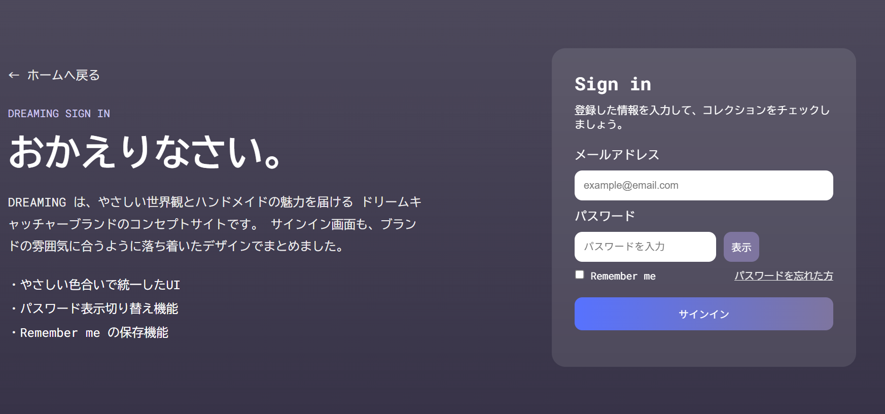

# 🌙 Dreaming Portfolio

## 🔗 Live Demo
[Dreaming Portfolio を見る](https://w25019.github.io/dreaming-portfolio/)

## 📝 概要
ドリームキャッチャーをテーマにしたマルチページWebサイトです。  
落ち着いたデザインと使いやすいUI/UXを意識して制作しました。

## 🛠 技術スタック
- HTML / CSS / JavaScript

## 💡 主な機能
- レスポンシブ対応
- お問い合わせフォーム（入力チェック）
- ログインUI（パスワード表示切替・localStorage）
- モーダル表示（商品詳細）

## 🎯 工夫した点
- シンプルで直感的なナビゲーション設計
- 色と余白で「落ち着き」を表現
- JavaScriptでユーザー操作のフィードバックを強化

## 📸 Screenshots

<table>
  <tr>
    <td align="center"><b>Home Page</b></td>
    <td align="center"><b>Contact Page</b></td>
  </tr>
  <tr>
    <td></td>
    <td></td>
  </tr>
  <tr>
    <td align="center"><b>About Page</b></td>
    <td align="center"><b>Login Page</b></td>
  </tr>
  <tr>
    <td></td>
    <td></td>
  </tr>
</table>

